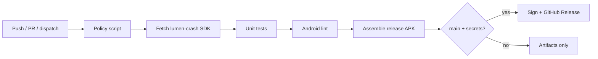

# CLens

[](https://github.com/Chloemlla/CLens/actions/workflows/clens-android.yml)
[](./LICENSE)
[](https://kotlinlang.org/)
[](#requirements)

Android Kotlin client for full MongoDB database administration.

> [!NOTE]
> CLens is a **mobile Mongo ops console**, not a desktop Studio 3T replacement.
> It optimizes for on-call phone workflows: connect, inspect, patch, export, and recover under weak networks.

> [!IMPORTANT]
> **Local Gradle build/test is prohibited** by repository guidelines.
> Verification only runs in GitHub Actions (`.github/workflows/clens-android.yml`).

---

## Features

### Core admin
- Encrypted connection profiles (URI or host form)
- Browse / create / rename / drop databases and collections
- Document insert, replace, update, delete with mobile structured editor
- Find / aggregate / explain
- Index create / list / drop
- Server overview, currentOps, killOp
- Readonly connection profiles
- Local audit log for destructive actions

### Advanced
- GridFS upload / download / delete
- Change Stream watch
- User / role CRUD
- Query history + favorites
- Collection validator management
- Biometric app lock + tiered destructive confirm
- Keep-alive / reconnect banner

### Offline cache and data handoff
- **Named offline snapshots** — save current filter first-N docs; browse read-only offline
- **Local staging queue** — failed insert/replace/import chunks are queued and auto-retried on network recovery
- **Multi-format export** — JSON / CSV / Extended-JSON lines (`.jsonl`) via Android Share Sheet
- **File import** — pick `.json` / `.csv`, preview fields, map columns, then insertMany

> [!TIP]
> Snapshot default limit is **100** (hard cap **500**).
> Staging queue holds up to **50** items; import is chunked at **50** docs/piece for retry granularity.

---

## Screens / navigation

| Tab | Purpose |
|-----|---------|
| Connections | Profiles, URI/form, test/connect, clipboard/QR import |
| Browse | Catalog, documents, editor, offline snapshots, page export |
| Query | Find/aggregate, visual filter builder, history/favorites |
| Admin | Indexes, server status, ops counter, currentOp/killOp |
| Advanced | GridFS, Change Stream, users/roles, file import/export, staging queue |
| Settings | Theme, biometric, list density |

---

## Repository layout

```text
android/                                 # Gradle root (Kotlin DSL + Compose)
  app/src/main/java/com/chloemlla/clens/
    core/mongo/                          # session, repository, URI helpers
    core/storage/                        # encrypted profiles, drafts, snapshots, staging
    core/export/                         # JSON / CSV / JSONL codecs
    core/importdata/                     # JSON/CSV parse + field mapping
    core/sync/                           # staging retry policy
    ui/                                  # Compose panels / controllers
docs/android-mongodb-client.md           # deeper engineering notes
.github/workflows/clens-android.yml      # verify + signed release
.github/scripts/                         # policy, lumen-crash fetch, SASL retention
```

<details>
<summary>Related sibling projects</summary>

- UI/toolchain/release posture mirrors [Synapse-Client](https://github.com/Chloemlla/Synapse-Client)
- Crash SDK: `com.chloemlla.lumen:lumen-crash` from Project Lumen releases/packages

</details>

---

## Requirements

| Item | Value |
|------|--------|
| Language | Kotlin |
| UI | Jetpack Compose + Material 3 |
| Min SDK | 26 |
| Compile / Target SDK | 37 (Android 17) |
| JDK (CI) | 21 |
| Gradle (CI) | 9.5.1 |
| AGP | 8.13.2 |
| Kotlin | 2.1.20 |
| Compose BOM | 2024.12.01 |
| MongoDB driver | `mongodb-driver-kotlin-coroutine` **5.2.1** |
| App ID | `com.chloemlla.clens` |

---

## Continuous integration

Workflow: [`.github/workflows/clens-android.yml`](.github/workflows/clens-android.yml)



Jobs:

1. **verify** — policy checks, unit tests, lint, release assemble, Mongo SASL retention check
2. **release** (`main`) — signed universal + ABI splits, checksums, GitHub Release

Triggers (path-filtered):

- `android/**`
- `android/lumen-crash.version`
- `.github/scripts/**`
- `.github/workflows/clens-android.yml`
- manual `workflow_dispatch`

> [!WARNING]
> Release signing requires repository secrets:
> `KEYSTORE_BASE64`, `KEYSTORE_PASSWORD`, `KEY_ALIAS`, `KEY_PASSWORD`.
> Generate/push them with [`setup-android-signing.ps1`](./setup-android-signing.ps1).

---

## Offline snapshot & staging (behavior)

### Snapshots
- Scope: **current filter**, first N documents
- Multi-snapshot per collection
- Metadata: name, connectionId, db, collection, filter, limit, createdAt, documentCount
- Storage: `filesDir/offline_snapshots/<id>.jsonl` + small index (docs are **not** stuffed into SharedPreferences)

### Staging queue
- Covers: document **insert/replace** and **batch import** failures
- Does **not** queue single-document delete or drop ops
- Auto-sync on app foreground / network recovery path
- Failed items keep `lastError` and remain retryable/manual discardable

### Export / import formats
| Format | Extension | Notes |
|--------|-----------|-------|
| JSON | `.json` | Pretty JSON array |
| CSV | `.csv` | Top-level fields only; nested object/array become JSON string cells |
| BSON dump (product) | `.jsonl` | Relaxed Extended JSON **lines** — not binary `.bson` |

> [!CAUTION]
> Binary `mongodump` `.bson` is **out of scope**.
> Large exports/imports are hard-capped to protect phone memory; prefer filtered snapshots and chunked imports.

---

## Security posture

- Connection secrets use encrypted storage with fail-closed behavior
- Readonly profiles block write paths
- Destructive actions use tiered confirm (type target name / long-press)
- Cleartext Mongo is denied by default network security config; non-TLS profiles show an in-app risk warning
- Action error messages pass through host secret sanitizer
- Crash capture via lumen-crash with product copy overrides

> [!WARNING]
> Prefer TLS for any shared or production environment.
> Cleartext Mongo should stay on trusted lab networks only.

---

## Crash reporting (lumen-crash)

CLens depends on `com.chloemlla.lumen:lumen-crash`.

- Version policy file: [`android/lumen-crash.version`](./android/lumen-crash.version) (`latest` or pinned)
- CI resolves/materializes artifacts via `.github/scripts/fetch-lumen-crash-sdk.py`
- Fallback: GitHub Packages (`LUMEN_CRASH_READ_PACKAGES_TOKEN` or `GITHUB_TOKEN`)
- ProGuard keeps fail-closed author integrity + public SDK surface

See [`docs/android-mongodb-client.md`](./docs/android-mongodb-client.md) for the full integration notes.

---

## Development policy

> [!IMPORTANT]
> Do **not** run local Gradle build/test on personal machines for this repo.
> Device performance is intentionally treated as insufficient; CI is the only verification gate.

Useful docs:

- Product/engineering deep dive: [`docs/android-mongodb-client.md`](./docs/android-mongodb-client.md)
- Agent/repository rules: [`AGENTS.md`](./AGENTS.md)

---

## License

GPL-3.0 — see [`LICENSE`](./LICENSE).
