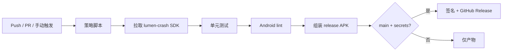

# CLens

[English](./README.md) | **简体中文**

[](https://github.com/Chloemlla/CLens/actions/workflows/clens-android.yml)
[](./LICENSE)
[](https://kotlinlang.org/)
[](#运行要求)

面向完整 MongoDB 管理场景的 Android Kotlin 客户端。

> [!NOTE]
> CLens 是**手机端 Mongo 运维控制台**，不是桌面 Studio 3T 的替代品。
> 它面向值班/救火手机工作流：连接、巡检、改数、导出，并在弱网下可恢复。

> [!IMPORTANT]
> 按仓库规范，**禁止在本机运行 Gradle build/test**。
> 验证只走 GitHub Actions（`.github/workflows/clens-android.yml`）。

---

## 功能

### 核心管理
- 加密连接档案（URI 或主机表单）
- 浏览 / 创建 / 重命名 / 删除 数据库与集合
- 文档插入、替换、更新、删除，含移动端结构化编辑器
- Find / aggregate / explain
- 索引创建 / 列表 / 删除
- 服务器概览、currentOps、killOp
- 只读连接档案
- 破坏性操作本地审计日志

### 高级能力
- GridFS 上传 / 下载 / 删除
- Change Stream 监听
- 用户 / 角色 CRUD
- 查询历史 + 收藏夹
- 集合 Validator 管理
- 生物识别应用锁 + 分级危险确认
- Keep-alive / 重连横幅

### 离线缓存与数据交接
- **命名离线快照** — 保存当前 filter 前 N 条文档，无网只读翻看
- **本地暂存队列** — insert/replace/import 分片失败入队，网络恢复后自动重试
- **多格式导出** — JSON / CSV / Extended-JSON 行（`.jsonl`），走 Android 系统分享
- **文件导入** — 选择 `.json` / `.csv`，字段预览与映射后 insertMany

> [!TIP]
> 快照默认 limit 为 **100**（硬上限 **500**）。
> 暂存队列最多 **50** 项；导入按 **50** 条/片 分片，便于重试。

---

## 页面 / 导航

| Tab | 用途 |
|-----|------|
| 连接 | 档案、URI/表单、测试/连接、剪贴板/二维码导入 |
| 浏览 | 目录、文档、编辑器、离线快照、当前页导出 |
| 查询 | Find/aggregate、可视化过滤构造器、历史/收藏 |
| 管理 | 索引、server status、Ops 计数、currentOp/killOp |
| 高级 | GridFS、Change Stream、用户角色、文件导入导出、待提交队列 |
| 设置 | 主题、生物识别、列表密度 |

---

## 仓库结构

```text
android/                                 # Gradle 根目录（Kotlin DSL + Compose）
  app/src/main/java/com/chloemlla/clens/
    core/mongo/                          # 会话、仓库、URI 工具
    core/storage/                        # 加密档案、草稿、快照、暂存队列
    core/export/                         # JSON / CSV / JSONL 编解码
    core/importdata/                     # JSON/CSV 解析 + 字段映射
    core/sync/                           # 暂存重试策略
    ui/                                  # Compose 面板 / 控制器
docs/android-mongodb-client.md           # 更细的工程说明
.github/workflows/clens-android.yml      # 校验 + 签名发布
.github/scripts/                         # 策略检查、lumen-crash 拉取、SASL 留存校验
```

<details>
<summary>相关兄弟项目</summary>

- UI / 工具链 / 发布姿态对齐 [Synapse-Client](https://github.com/Chloemlla/Synapse-Client)
- 崩溃 SDK：`com.chloemlla.lumen:lumen-crash`（Project Lumen 发布物 / Packages）

</details>

---

## 运行要求

| 项 | 值 |
|------|--------|
| 语言 | Kotlin |
| UI | Jetpack Compose + Material 3 |
| Min SDK | 26 |
| Compile / Target SDK | 37（Android 17） |
| JDK（CI） | 21 |
| Gradle（CI） | 9.5.1 |
| AGP | 8.13.2 |
| Kotlin | 2.1.20 |
| Compose BOM | 2024.12.01 |
| MongoDB 驱动 | `mongodb-driver-kotlin-coroutine` **5.2.1** |
| 应用 ID | `com.chloemlla.clens` |

---

## 持续集成

工作流：[`.github/workflows/clens-android.yml`](.github/workflows/clens-android.yml)



任务：

1. **verify** — 策略检查、单元测试、lint、release 组装、Mongo SASL 留存检查
2. **release**（`main`）— 签名 universal + ABI 分包、校验和、GitHub Release

触发（路径过滤）：

- `android/**`
- `android/lumen-crash.version`
- `.github/scripts/**`
- `.github/workflows/clens-android.yml`
- 手动 `workflow_dispatch`

> [!WARNING]
> 发布签名需要仓库 Secrets：
> `KEYSTORE_BASE64`、`KEYSTORE_PASSWORD`、`KEY_ALIAS`、`KEY_PASSWORD`。
> 可用 [`setup-android-signing.ps1`](./setup-android-signing.ps1) 生成并写入。

---

## 离线快照与暂存（行为）

### 快照
- 作用域：**当前 filter** 的前 N 条文档
- 同一集合可有多份快照
- 元数据：name、connectionId、db、collection、filter、limit、createdAt、documentCount
- 存储：`filesDir/offline_snapshots/<id>.jsonl` + 小索引（文档**不**塞进 SharedPreferences）

### 暂存队列
- 覆盖：文档 **insert/replace** 与 **批量 import** 失败
- **不**入队：单文档 delete 或 drop 类破坏操作
- 应用回到前台 / 网络恢复路径自动同步
- 失败项保留 `lastError`，可手动重试或丢弃

### 导入导出格式
| 格式 | 扩展名 | 说明 |
|--------|-----------|-------|
| JSON | `.json` | Pretty JSON 数组 |
| CSV | `.csv` | 仅展平顶层字段；嵌套 object/array 写成 JSON 字符串单元格 |
| BSON dump（产品语义） | `.jsonl` | Relaxed Extended JSON **逐行** — 不是二进制 `.bson` |

> [!CAUTION]
> 二进制 `mongodump` `.bson` **不在范围内**。
> 大结果导入导出有硬上限以保护手机内存；优先用过滤快照与分片导入。

---

## 安全策略

- 连接密钥使用加密存储，失败即熔断
- 只读档案阻断写路径
- 破坏性操作分级确认（输入目标名 / 长按）
- 默认网络安全配置拒绝明文流量；非 TLS 档案会显示风险提示
- 动作错误信息经主机侧 secret sanitizer 处理
- 崩溃捕获走 lumen-crash，并支持产品文案覆盖

> [!WARNING]
> 共享或生产环境请优先 TLS。
> 明文 Mongo 仅建议留在受信任实验网络。

---

## 崩溃上报（lumen-crash）

CLens 依赖 `com.chloemlla.lumen:lumen-crash`。

- 版本策略文件：[`android/lumen-crash.version`](./android/lumen-crash.version)（`latest` 或钉死版本）
- CI 通过 `.github/scripts/fetch-lumen-crash-sdk.py` 解析/物化产物
- 回退：GitHub Packages（`LUMEN_CRASH_READ_PACKAGES_TOKEN` 或 `GITHUB_TOKEN`）
- ProGuard 保留 fail-closed 作者完整性与公共 SDK 表面

完整集成说明见 [`docs/android-mongodb-client.md`](./docs/android-mongodb-client.md)。

---

## 开发规范

> [!IMPORTANT]
> **不要**在个人电脑对本仓库跑本地 Gradle build/test。
> 本机性能按规范视为不足；CI 是唯一验证门。

相关文档：

- 产品 / 工程深读：[`docs/android-mongodb-client.md`](./docs/android-mongodb-client.md)
- Agent / 仓库规则：[`AGENTS.md`](./AGENTS.md)

---

## 许可证

GPL-3.0 — 见 [`LICENSE`](./LICENSE)。
